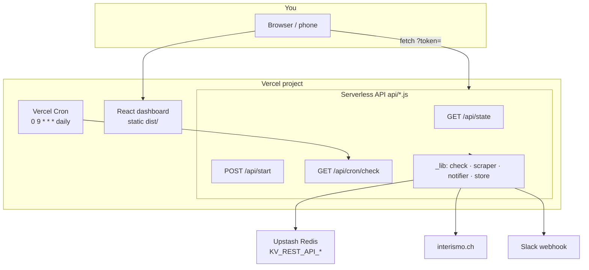
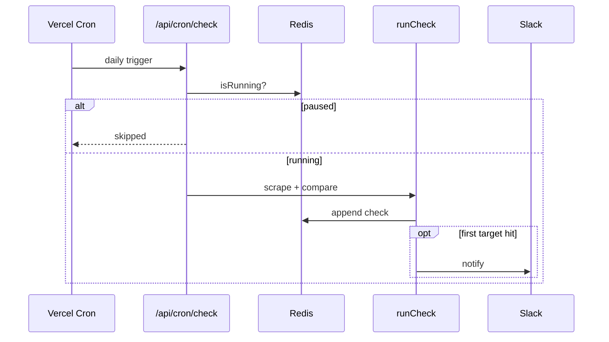
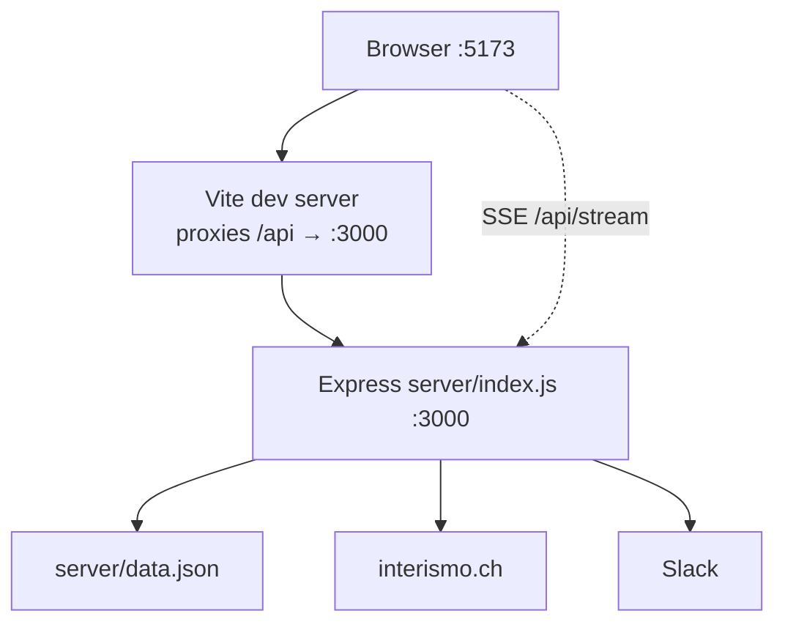
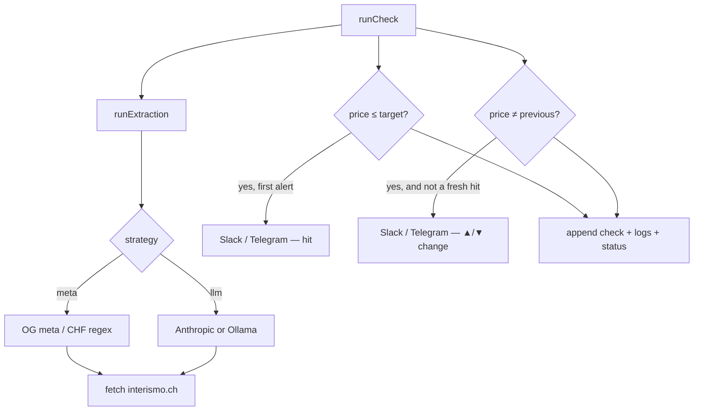

# Coffee Price Sentinel — Architecture & operations

This document describes how the system is built, how components interact, and how to run it **locally** or on **Vercel**.

The app monitors the price of *Bialetti Café Perfetto Moka CLASSICO 250 g* on [interismo.ch](https://www.interismo.ch) and alerts you (Slack / Telegram) when the scraped price is **at or below** your target, or when the price **moves up or down** vs the previous check.

---

## Table of contents

1. [Deployment flavors](#deployment-flavors)
2. [System topology (Vercel)](#system-topology-vercel)
3. [System topology (local)](#system-topology-local)
4. [Repository layout](#repository-layout)
5. [API surface](#api-surface)
6. [Data model](#data-model)
7. [Price check pipeline](#price-check-pipeline)
8. [Environment variables](#environment-variables)
9. [Run locally](#run-locally)
10. [Run on Vercel](#run-on-vercel)
11. [Expose locally with ngrok](#expose-locally-with-ngrok)
12. [Troubleshooting](#troubleshooting)

---

## Deployment flavors

| | **Vercel** | **Local (Express)** |
|---|------------|---------------------|
| **Backend** | Serverless functions in `api/` | Long-running Node.js in `server/` |
| **Frontend** | Static build on Vercel CDN | Vite dev server (`:5173`) or served from `dist/` on `:3000` |
| **Persistence** | Upstash Redis (Vercel Storage) | `server/data.json` |
| **Scheduling** | Vercel Cron (`vercel.json`) + `isRunning` flag | In-process `setTimeout` loop (`checkEvery`) |
| **Live UI updates** | Poll `GET /api/state` every ~3 s | Server-Sent Events (`GET /api/stream`) |
| **Deploy artifact** | `api/` + `dist/` ( `server/` is ignored via `.vercelignore` ) | `server/` + optional `dist/` |

Both flavors expose the **same REST API** to the React dashboard. Only transport and persistence differ.

---

## System topology (Vercel)



### Request flows (Vercel)

**First dashboard load (bootstrap)**

1. Browser opens `https://<app>/#token=<ACCESS_TOKEN>`.
2. React polls `GET /api/state`.
3. If Redis has **no checks yet**, `api/_lib/bootstrap.js` acquires a lock and runs **one** `runCheck()` before returning the snapshot.
4. UI shows price, chart seed, and logs without clicking ↻ Now.

**Ongoing sync**

- React polls `GET /api/state` every **3 s** (30 s when the tab is hidden).
- No SSE — serverless functions cannot hold long-lived connections reliably.

**Manual controls**

| UI | API | Effect |
|----|-----|--------|
| Start | `POST /api/start` | `isRunning=true`, runs **immediate** check, enables daily cron |
| Pause | `POST /api/stop` | `isRunning=false` — cron skips |
| ↻ Now | `POST /api/check-now` | Check always (even if paused) |
| 🧪 Test | `POST /api/notifier/test` | Test Slack/Telegram only |

**Scheduled checks**

1. Vercel Cron calls `GET /api/cron/check` (~09:00 UTC by default).
2. If `isRunning === false` → skip.
3. Else → `runCheck()` → save to Redis → notify on **first** transition to target hit (edge-triggered), and on **any** price change vs the previous check.



---

## System topology (local)



- **Scheduler** (`server/scheduler.js`) owns a `setTimeout` loop driven by `config.checkEvery` (minutes).
- **Start** runs a check **immediately**, then schedules the next wake-up.
- **State** is in-memory with debounced writes to `data.json`.

---

## Repository layout

```
.
├── src/                    # React dashboard (Vite)
│   └── App.jsx             # REST client; polling (Vercel) or SSE (local)
├── api/                    # Vercel serverless only
│   ├── state.js            # GET snapshot + optional bootstrap check
│   ├── config.js           # POST config patch
│   ├── start.js · stop.js
│   ├── check-now.js
│   ├── health.js           # Unauthenticated liveness
│   ├── cron/check.js       # Vercel Cron entry
│   ├── notifier/test.js
│   ├── alert/dismiss.js
│   └── _lib/
│       ├── store.js        # Redis (Upstash)
│       ├── redis.js        # KV client + env detection
│       ├── check.js        # One end-to-end price check
│       ├── scraper.js      # Meta tag / LLM extraction
│       ├── notifier.js     # Slack + Telegram
│       ├── bootstrap.js    # First-load initial check
│       ├── auth.js         # ACCESS_TOKEN guard
│       └── errors.js       # 503 when KV missing
├── server/                 # Local Express only (.vercelignore)
│   ├── index.js            # Routes + static dist/ + SSE
│   ├── scheduler.js
│   ├── state.js            # data.json persistence
│   ├── scraper.js
│   └── notifier.js
├── vercel.json             # Cron schedule + function maxDuration
├── vite.config.js          # Dev proxy /api → localhost:3000
└── docs/
    └── ARCHITECTURE.md     # This file
```

Scraper and notifier logic are duplicated between `api/_lib/` and `server/` so each runtime stays self-contained.

---

## API surface

| Method | Path | Auth | Local | Vercel | Notes |
|--------|------|------|-------|--------|-------|
| `GET` | `/api/state` | Yes* | ✓ | ✓ | Full snapshot; bootstrap on first empty history (Vercel) |
| `POST` | `/api/config` | Yes* | ✓ | ✓ | Partial config update |
| `POST` | `/api/start` | Yes* | ✓ | ✓ | Start loop / enable cron + immediate check |
| `POST` | `/api/stop` | Yes* | ✓ | ✓ | Pause |
| `POST` | `/api/check-now` | Yes* | ✓ | ✓ | Force one check |
| `POST` | `/api/alert/dismiss` | Yes* | ✓ | ✓ | Clear alert flag |
| `POST` | `/api/notifier/test` | Yes* | ✓ | ✓ | Test notifications |
| `GET` | `/api/stream` | Yes* | ✓ | — | SSE live updates |
| `GET` | `/api/cron/check` | Cron / token | — | ✓ | Vercel Cron + manual curl |
| `GET` | `/health` | No | ✓ | — | Local liveness |
| `GET` | `/api/health` | No | — | ✓ | Vercel liveness + `kvConfigured` |

\*When `ACCESS_TOKEN` is set, pass `?token=<value>` or `Authorization: Bearer <value>`.

---

## Data model

Stored fields (Redis keys or `data.json`):

| Key / section | Contents |
|---------------|----------|
| `config` | `productUrl`, `targetPrice`, `checkEvery`, `strategy`, `backend`, Ollama settings |
| `status` | `isRunning`, `loading`, `alert`, `nextCheckAt`, `lastCheckAt` |
| `checks[]` | `{ ts, price, method, hit }` — price history for chart |
| `logs[]` | `{ ts, msg, type }` — agent log (newest first in UI) |

**Hit rule:** `price <= targetPrice` (target is a ceiling — any price at or below triggers).

**Alerts:**
- **Target hit** — only on the **transition** into hit state (`alert` was false → true), not on every subsequent check.
- **Price movement** — whenever the scraped price differs from the last known price (▲ up or ▼ down). Skipped on the same tick as a fresh hit notify so you don’t get two messages for one drop past the target.

---

## Price check pipeline



- **Meta (default):** reads `product:price:amount` from HTML — no API cost.
- **LLM:** optional; needs `ANTHROPIC_API_KEY` on Vercel or in `server/.env`. Ollama only works on local network.

---

## Environment variables

### Local (`server/.env`)

Copy `server/.env.example` → `server/.env`.

| Variable | Required | Purpose |
|----------|----------|---------|
| `PORT` | No | Default `3000` |
| `ACCESS_TOKEN` | Recommended if exposed | Guards `/api/*` |
| `SLACK_WEBHOOK_URL` | Optional | Slack alerts |
| `TELEGRAM_BOT_TOKEN` + `TELEGRAM_CHAT_ID` | Optional | Telegram alerts |
| `ANTHROPIC_API_KEY` | If LLM + Anthropic | LLM extraction |

### Vercel (Project → Settings → Environment Variables)

| Variable | Required | Purpose |
|----------|----------|---------|
| `KV_REST_API_URL` + `KV_REST_API_TOKEN` | **Yes** | Auto-injected when Upstash Redis is connected via Storage |
| `ACCESS_TOKEN` | Strongly recommended | API auth; use in URL `#token=...` |
| `SLACK_WEBHOOK_URL` | Optional | Slack alerts |
| `TELEGRAM_BOT_TOKEN` + `TELEGRAM_CHAT_ID` | Optional | Telegram |
| `ANTHROPIC_API_KEY` | If LLM | Anthropic only |
| `CRON_SECRET` | Optional | Vercel sends `Authorization: Bearer` on cron invocations |

Also accepted: `UPSTASH_REDIS_REST_URL` / `UPSTASH_REDIS_REST_TOKEN`.

Generate a token:

```bash
node -e "console.log(require('crypto').randomBytes(24).toString('base64url'))"
```

---

## Run locally

### Prerequisites

- Node.js 18+
- npm

### One-time setup

```bash
git clone git@github.com:mortada87/price-tracker.git
cd price-tracker
npm install
npm run server:install
cp server/.env.example server/.env
# Edit server/.env — at minimum SLACK_WEBHOOK_URL if you want alerts
```

### Development (recommended) — two terminals

**Terminal 1 — API**

```bash
npm run server
# or: npm run server:dev   # restart on file changes
```

Listens on **http://localhost:3000**.

**Terminal 2 — UI**

```bash
npm run dev
```

Opens **http://localhost:5173**. Vite proxies `/api/*` to port 3000.

1. Set target price in the UI.
2. Click **▶ START MONITORING** — runs a check immediately, then repeats every `checkEvery` minutes.
3. Closing the browser does **not** stop the server loop.

If `ACCESS_TOKEN` is set in `server/.env`, open:

```
http://localhost:5173/#token=<your-token>
```

### Production-like local (single port)

Builds the UI and serves it from Express on one port (good for ngrok):

```bash
npm run prod
```

Open **http://localhost:3000** (and `#token=...` if auth is enabled).

### Verify local API

```bash
curl -s http://localhost:3000/health
curl -s http://localhost:3000/api/state
# with auth:
curl -s "http://localhost:3000/api/state?token=YOUR_TOKEN"
```

---

## Run on Vercel

### Prerequisites

- GitHub repo: [mortada87/price-tracker](https://github.com/mortada87/price-tracker)
- Vercel account
- Upstash Redis connected to the project (Storage)

### 1. Connect Git

1. [Vercel dashboard](https://vercel.com) → **Add New → Project**
2. Import **mortada87/price-tracker**
3. Framework: **Vite** (auto-detected)
4. Deploy

The `server/` folder is **not** deployed (see `.vercelignore`).

### 2. Add Redis (required)

1. Project → **Storage** → **Create Database**
2. **Upstash** → **Redis** → create → **Connect to this project**
3. Confirm **Environment Variables** include `KV_REST_API_URL` and `KV_REST_API_TOKEN`
4. **Redeploy**

Without Redis, `/api/state` returns **503** with a setup hint in the UI.

### 3. Set secrets

Project → **Settings** → **Environment Variables** (Production):

- `ACCESS_TOKEN` — long random string
- `SLACK_WEBHOOK_URL` — your Slack incoming webhook
- `CRON_SECRET` — optional but recommended

Redeploy after changes.

### 4. Open the app

```
https://<your-project>.vercel.app/#token=<ACCESS_TOKEN>
```

1. First load may take a few seconds (bootstrap scrape).
2. Click **▶ START MONITORING** to enable **daily cron** checks.
3. Use **↻ Now** anytime for an immediate check.
4. Use **🧪 Test alert** to verify Slack.

### 5. Cron schedule

Defined in `vercel.json`:

```json
"schedule": "0 9 * * *"
```

≈ once per day at **09:00 UTC** (Hobby tier limit). The **CHECK EVERY** pills in the UI are advisory on Vercel; change the cron expression to adjust cadence (Pro allows more frequent runs).

### Verify Vercel deployment

```bash
# Health (no auth)
curl -s "https://<your-project>.vercel.app/api/health"

# State (with auth)
curl -s "https://<your-project>.vercel.app/api/state?token=YOUR_TOKEN"

# Manual cron (requires Start first, or isRunning in KV)
curl -s "https://<your-project>.vercel.app/api/cron/check" \
  -H "Authorization: Bearer YOUR_ACCESS_TOKEN"
```

Expected health when KV is OK:

```json
{"ok":true,"kvConfigured":true,...}
```

### Deployment protection

If Vercel **Deployment Protection** is enabled, anonymous `curl` and browsers may see an HTML login page instead of JSON. Either disable protection for Production or test while logged into Vercel.

---

## Expose locally with ngrok

Use when you want the app on your laptop but reachable from your phone or Slack webhooks testing:

```bash
# 1. Configure server/.env (ACCESS_TOKEN, SLACK_WEBHOOK_URL, …)
# 2. Single-process serve
npm run prod

# 3. Tunnel (static domain example)
ngrok http --domain=your-name.ngrok-free.app 3000
```

Open:

```
https://your-name.ngrok-free.app/#token=<ACCESS_TOKEN>
```

---

## Troubleshooting

| Symptom | Likely cause | Fix |
|---------|----------------|-----|
| UI: Storage / KV hint | Redis not connected | Storage → Upstash → Connect → **Redeploy** |
| UI: `unauthorized` | Missing / wrong token | Open `/#token=<ACCESS_TOKEN>` |
| UI: Backend unreachable (500) | KV or function error | Check Vercel **Functions** logs for `/api/state` |
| No price on Vercel until tomorrow | Cron only; bootstrap failed | Click **↻ Now**; check function logs |
| Cron never runs | `isRunning` is false | Click **Start** in dashboard |
| Slack test works, no hit alert | Edge-trigger: already in alert state | Dismiss alert or raise target above current price |
| Ollama on Vercel | Localhost unreachable | Use **meta** or **Anthropic** on Vercel |
| `price-tracker.vercel.app` 404 | Wrong domain | Use URL from **Deployments → Visit** |

---

## Related docs

- [README.md](../README.md) — quick start and feature overview
- [server/.env.example](../server/.env.example) — local env template
